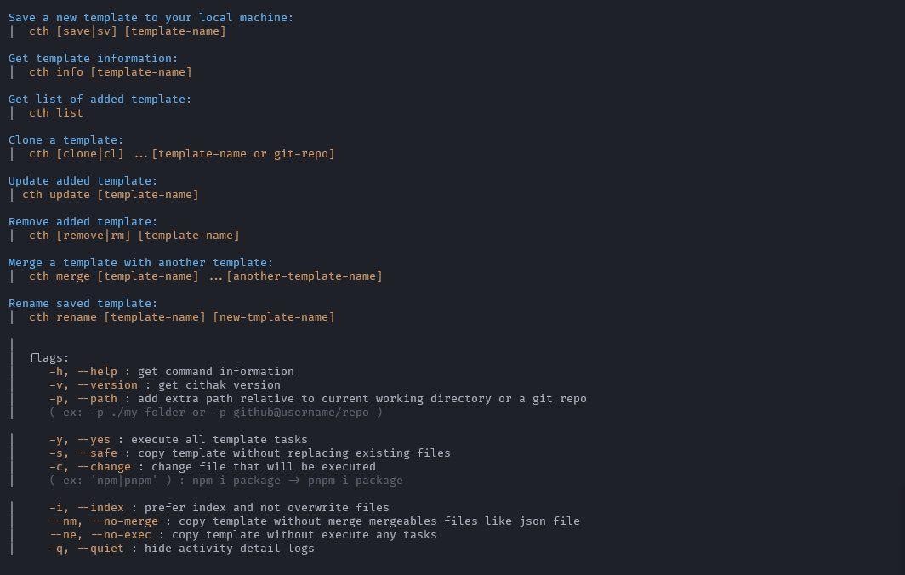

# Cithak


---

[](https://www.javascript.com)
[](./LICENSE.md)
[](https://github.com/KucingKode/Cithak)
[](https://www.npmjs.com/package/cithak)
[](https://www.npmjs.com/package/cithak)

[](https://GitHub.com/KucingKode/Cithak/stargazers/)

Homepage: <https://KucingKode.github.io/Cithak>  
File merging powered with [Dmerge.js](https://github.com/KucingKode/Dmerge)

## 🤔 What Is This

Cithak is a **simple, secure yet powerful template manager** CLI. Cithak can merge two templates by merge configuration files from those templates and Cithak was designed to be safe and transparent, so everything will be done under your permission.

## 📚 Motivation

Cithak was created because sometimes **a template will broke other templates and templates are difficult to manage or combine**. We solve this problem by give Cithak ability to merge readme and configuration files and ability to clone templates from github, gitlab, bitbucket, or your local storage with just simple CLI

## 💻 Features

- ### **Secure**

  Cithak will log every activities and execute every tasks that you **give permission to execute**, or you can disable task execution with `--no-exec` flag

- ### **Smart**

  Cithak can **do more than overwrite your files**, it can give index or merge data from two [mergeable files](#mergeable-files) like `.json`, `.yaml`, `.env` and some other configuration files, you can disable this feature with `--no-merge` flag

- ### **Flexible**

  Cithak can **use template from anywhere**, clone templates from your local storage, github, gitlab, or bitbucket using git. You can use cithak with or without internet connection

## 📂 Installation

- Node.js

```bash
npm install -g cithak
```

- Windows, Linux, Mac

To use Cithak on Windows, Linux, or Mac without node js, download the latest executable for your operating system from [releases](https://github.com/KucingKode/Cithak/releases)

---

## 📃 Documentation

- [Quick Start](#-quick-start)
- [Docs](#-docs)
- [Contributing](./CONTRIBUTING.md)
- [Code Of Conduct](./CODE_OF_CONDUCT.md)
- [License](./LICENSE.md)

## 💡 Quick Start

- **Create a template**  
  Create a new folder for your template, you can configure your template inside `template.json`, it can contain description for your template and many more, for more information about `template.json`, [read this section](#template-json).

```json
{
  "description": "describe-your-template-here"
}
```

- **Save new template**  
  To save a template just go to your template and type `cth save [template-name]`

- **Check your template**  
  After you save your template just check your template by using `cth info [template-name]`, it should log your template name and it's description

- **Clone to your project**  
  The last thing you want to do is just clone your template to your project by typing `cth clone [template-name]`.

Congratulation, now you know how to use Cithak CLI🎉

## 📘 Docs

- [CLI](#cli)
- [mergeable Files](#mergeable-files)
- [template.json](#template-json)

### CLI



for more CLI information type `cth help` in your terminal or [search for command example](https://kucingkode.github.io/Cithak/#commands)

### mergeable Files

- **YAML** : `*.yml`, `*.yaml`
- **TOML** : `*.toml` `*.tml`
- **JSON** : `*.json`
- **README** : `README.[md, txt, markdown]`
- **ENV** : `*.env`
- **REST** : `*.rest`
- `.prettierrc`
- `.gitignore`
- `.npmignore`
- `.prettierignore`

### Template JSON

template.json is important for your template, it contains description and tasks of your template, template.json must have `description` that describe the template, and template.json can also have:

- **tasks**

tasks is array of string contains all commands will executed

```js
{
   "tasks": [
      "npm i package",
      "node index.js",
      "echo 'hello'"
   ]
}
```

- **include**

include is array of [glob](https://github.com/isaacs/node-glob#readme) string will include a file to the template folder if that file or folder is outside from the template folder.

```js
"include": [
   "../outside.js",
   "../outside-folder/outside2.js"
]
```

- **exclude**

exclude is array of [glob](https://github.com/isaacs/node-glob#readme) string that will ignore files that match with it's pattern

```js
"exclude": [
   "**/*-ignore.*"
]
```

**More information, [Visit our website](https://KucingKode.github.io/Cithak)**

---

## 🎂 Contibuting

If you interested in contributing to this project, please read our [CONTRIBUTING.md](./CONTRIBUTING.md).

> We are currently working on rewriting Cithak to TypeScript to make the cithak code more understandable and clear

## 📃 License

Cithak was published under [MIT License](./LICENSE.md).
